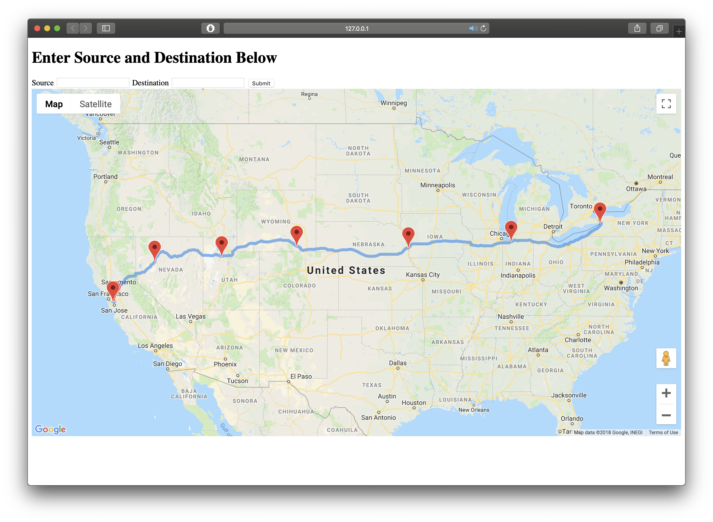

## WayPoints
The purpose of the project is to display route from a source location to a destination location while also displaying the 
various waypoints along the route. When the user clicks on one of thee waypoints the temperature in that particular city is displayed.

## Motivation
The motivation behind the project is to learn the following.
1) Get used to building client-server systems.  
2) Working with APIs to distributed services.  
3) Working with the database.  
4) Understand and choose the web application stack.  

## Code style
PEP 8 for python

## Tech/framework used
<b>Technologies used</b>
- [python](http://python.org)  
- [flask](http://flask.pocoo.org)  
- [mongodb](https://www.mongodb.com)  
- [docker](https://www.docker.com)  

<b>Built with</b>
- [Intellij IDEA](https://www.jetbrains.com/idea/)  

## Installation and setup
Provide step by step series of examples and explanations about how to get a development env running.

Open terminal  

<b>Install the necessary python packages</b>  
pip install pymongo  
pip install googlemaps  
pip install googlemaps  
pip install flask  

<b>Install docker in your system </b>  
https://docs.docker.com/install/   
docker run -it -p 27017:27017  -d mongo   
cd ProjectFolder/src   
python createIndex.py   

## Tests

Open terminal  
<b>In one tab do the following.</b>  
cd ProjectFolder/src   
python main.py &  

<b>In another tab do the following.</b>  
curl "localhost:5000" > test.html.  
The curl call will display the time taken for the code to execute and will also return the html. 
This can be used to test the code with cache and without cache and see the difference.

## How to use?
Start the flask server  
cd ProjectFolder/src   
python main.py &  

To use the waypoints application simply go to the localhost:5000/ url and enter the source and destination in the textboxes. 
A vedio demo is included in the resources folder.  

## Credits
The google waypoints example provided in the official documentation.
w3 schools for great html tutorials and reference.

## License
MIT © [rishi]()